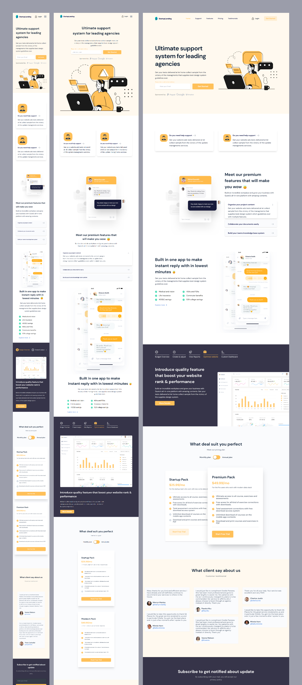

# Support agency website

## Overview

This is an awesome interactive website landing page I've created from StartupLanding Design templates in addition to many improvements over the original design.

## Features

The website has many features including the following

Users should be able to:

- View the nav link indicator for the currently active section in view
- view a fixed to the top navbar with a new state instead of the default
- View the optimal layout for the site depending on their device's screen size
- see an interactive and animated accordion
- See all features quality in a horizontal tabbed slider
- having a button to toggle monthly/annual pricing cards with flipping cards effect
- See all testimonials in a horizontal draggable/scrollable slider
- See hover states for all interactive elements on the page
- Receive an error message when the newsletter sign-up `form` is submitted if:
  - The `input` field is empty
  - The email address is not formatted correctly

## Links

- [Live Demo URL](https://agency-website-landing-nextjs.onrender.com)
- [ Design Owner URL ](https://startuplanding.redq.io)

## Built with

- Semantic HTML5 markup
- TailwindCSS and Sass
- Mobile-first workflow
- Next.js
- Swiper.js

## Screenshots

## Get started

### The Available Scripts:

In the project directory, you can run:

### `npm run dev`

Runs the app with next dev in the development mode.\
Open [http://localhost:3000](http://localhost:3000) to view it in the browser.

### `npm run build`

Builds the app for production to the `.next` / `out` folder.\
It correctly bundles the app in production mode and optimizes the build for the best performance.

The app is ready to be deployed!

### `npm run start`

Runs a preview for the website in production mode from `.next` folder.
